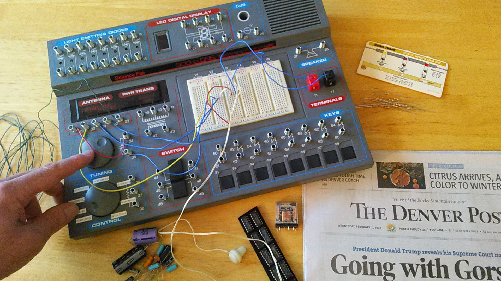

# More Sample Works

The `doc` directory contains documentation samples that are:
- a small sample of the hundreds of technical/user/procedural documents written in my career
- the sole authorship of myself
- (typically) written during a short-term contract (6 or 12 months)

I would suggest, at the least, to scan each document's table of contents.
Also, glance at each of the reference sections, that refer to other companion documents (that I authored).
Also, review each document's change log (located in the document's appendix section).

Question for you:
----------------------------------------------------------------------
Pictured below, is a Science Project/Radio Shack `300-in-1` electronics hobby kit.  Do you remember?
I still have mine.  I also received a `20-in-1` for my 10th birthday, which started this whole interest.

    - Can you guess what electronic project is shown below?

Yeah, the image resolution is a challenge.
Hint: it has 4 basic components (including a diode and resistor), no batteries required!, but needs a solid ground source.

